# DOCUMENTO ORIENTADOR MAESTRO: SISTEMA DOBLE DIAMANTE (PIIP - AGROIDEAS)

> **Guía Técnica y Funcional del Aplicativo Web para la Gestión de la Innovación Pública**  
> *Programa de Compensaciones para la Competitividad (AGROIDEAS - MIDAGRI)*  
> *Conforme a la Norma Técnica de Gestión de la Innovación Pública (NT-GIP N° 003-2025-PCM-SGP)*

---

## 1. PROPÓSITO Y VISIÓN GENERAL

El **Portafolio Institucional de Innovación Pública (PIIP) - AGROIDEAS** es una plataforma web desarrollada bajo una arquitectura **Multipage Application (MPA) Local-First** orientada a digitalizar, estandarizar y asegurar la trazabilidad metodológica del **Doble Diamante** en el sector público agrario.

El aplicativo permite a los especialistas, líderes de proyectos y unidades orgánicas (UPDC, UPP, UN, UAJ, etc.) gestionar iniciativas de innovación desde su fase inicial de exploración empírica hasta la validación y mitigación de riesgos de soluciones finales.

### Principales Capacidades del Sistema:
1. **Portafolio Centralizado (13 Iniciativas Reales):** Dashboard institucional con los proyectos oficiales de AGROIDEAS (`PIIP-2026-IN0001` a `PIIP-2026-IN0013`) con trazabilidad de fases en semáforo (`D1`, `D2`, `I3`, `E4`).
2. **11 Herramientas Metodológicas Estructuradas:** Formularios y pizarras visuales divididas en las 4 fases del Doble Diamante.
3. **Persistencia Local y Cero Latencia:** Motor de datos basado en `localStorage` con modelo de entidades relacionales simuladas e integridad referencial forzada.
4. **Contexto de "Proyecto Activo":** Capacidad de seleccionar un proyecto en el Dashboard y sincronizarlo automáticamente a lo largo de toda la navegación del sistema.
5. **Precarga Contextual Inteligente:** Botones en cada herramienta que autocompletan los formularios con datos reales de la iniciativa activa para demostraciones, capacitación y QA.
6. **Ficha Consolidada Integral:** Modal de 5 pestañas que agrupa toda la evidencia, ideas, prototipos y riesgos de una iniciativa en una única vista panorámica.

---

## 2. ESTRUCTURA DEL PROYECTO Y ORGANIZACIÓN DE ARCHIVOS

El repositorio organiza sus recursos de forma semántica y modular:

```plaintext
App_Sistema_Doble_Diamante/
│
├── index.html                     # Portafolio Institucional (Dashboard Principal)
│
├── fase1/                         # FASE 1: DESCUBRIR (Divergencia - Área del Problema)
│   ├── 01-observacion.html        # H01: Observación de Campo (Método AEIOU)
│   ├── 02-mapa-empatia.html       # H02: Mapa de Empatía (6 Cuadrantes)
│   └── 03-encuestas.html          # H03: Encuestas y Entrevistas Estructuradas
│
├── fase2/                         # FASE 2: DEFINIR (Convergencia - Área del Problema)
│   ├── 04-ficha-persona.html      # H04: Ficha de Persona / Arquetipos de Usuario
│   ├── 05-grupos-focales.html     # H05: Muro de Hallazgos (Research Wall / Insights)
│   ├── 05-muro-hallazgos.html     # H05: Alias idéntico para acceso directo
│   └── 06-definicion-desafio.html # H06: Desafío de Innovación (HMW + Asistente Mad-Libs)
│
├── fase3/                         # FASE 3: IDEAR (Divergencia - Área de la Solución)
│   ├── 07-lluvia-ideas.html       # H07: Lluvia de Ideas y Dinámica Crazy 8's
│   ├── 08-matriz-priorizacion.html# H08: Matriz de Priorización Multicriterio (1-5)
│   └── 09-prototipado-rapido.html # H09: Prototipado Rápido, Storyboards y Asistente IA
│
├── fase4/                         # FASE 4: ENTREGAR (Convergencia - Área de la Solución)
│   ├── 10-plan-accion.html        # H10: Plan de Acción y Roadmap de Implementación
│   └── 11-matriz-riesgos.html     # H11: Matriz de Gestión de Riesgos y Testeo
│
├── js/                            # CAPA LÓGICA Y CONTROLADORES JAVASCRIPT
│   ├── layout.js                  # Inyector de layout: Sidebar, Breadcrumb, CDNs y eventos
│   ├── database.js                # Mock ORM, esquema relacional, migraciones y CRUD
│   └── app.js                     # Controlador maestro, DataTables y asistentes interactivos
│
├── data/                          # DATOS SEMILLA Y FUENTES INSTITUCIONALES
│   ├── seed.js                    # Semilla JS oficial (13 iniciativas y 11 colecciones H01-H11)
│   ├── piip_01_completo_h01_a_h11.json ... piip_13_... # Fichas estructuradas completas
│   └── raw_fichas.json            # Extracción documental de fuentes AGROIDEAS
│
├── css/                           # ESTILOS Y PERSONALIZACIÓN VISUAL
│   └── style.css                  # Reglas CSS complementarias y clases BEM
│
├── scripts/                       # UTILITARIOS DE MANTENIMIENTO Y GENERACIÓN
│   ├── generate_seed.py           # Generación automatizada de data/seed.js
│   ├── extract_fichas.py          # Extracción y limpieza de datos JSON
│   └── fix_seo.py                 # Auditoría y estandarización de metadatos SEO
│
└── doc/                           # DOCUMENTACIÓN TÉCNICA Y METODOLÓGICA
    ├── 00_DOCUMENTO_ORIENTADOR_SISTEMA_PIIP.md # Este documento orientador maestro
    ├── 01_Objetivo_Metodologia.md # Marco metodológico y detalle de las 11 herramientas
    ├── 02_Arquitectura_Stack.md   # Arquitectura cliente, componentes y dependencias
    ├── 03_Diccionario_Datos.md    # Esquema relacional JSON y diccionario de atributos
    └── 04_Flujos_Eventos.md       # Ciclo de vida de eventos, arranque y reactividad
```

---

## 3. MAPA METODOLÓGICO: LAS 11 HERRAMIENTAS DEL DOBLE DIAMANTE

```mermaid
graph LR
    subgraph D1["1. DESCUBRIR (Divergencia)"]
        H01["H01: Observación AEIOU"]
        H02["H02: Mapa Empatía"]
        H03["H03: Encuestas"]
    end
    subgraph D2["2. DEFINIR (Convergencia)"]
        H04["H04: Ficha Persona"]
        H05["H05: Muro Hallazgos"]
        H06["H06: Desafío HMW"]
    end
    subgraph I3["3. IDEAR (Divergencia)"]
        H07["H07: Lluvia Ideas / Crazy 8's"]
        H08["H08: Matriz Priorización"]
        H09["H09: Prototipado / IA"]
    end
    subgraph E4["4. ENTREGAR (Convergencia)"]
        H10["H10: Plan de Acción"]
        H11["H11: Matriz de Riesgos"]
    end

    D1 --> D2
    D2 --> I3
    I3 --> E4
```



| Fase | Herramienta | Archivo | Objeto de Estudio | Salida / Output Clave |
| :--- | :--- | :--- | :--- | :--- |
| **Fase 1** | H01: Observación AEIOU | `fase1/01-observacion.html` | Actividades, Entornos, Interacciones, Objetos y Usuarios | Matriz cualitativa de campo |
| **Fase 1** | H02: Mapa de Empatía | `fase1/02-mapa-empatia.html` | Pensamientos, sentimientos, estímulos visuales, auditivos y verbales | Cuadrante de Dolores y Alegrías |
| **Fase 1** | H03: Encuestas de Campo | `fase1/03-encuestas.html` | Percepción, canales de atención y satisfacción | Métricas cuantitativas y hallazgos |
| **Fase 2** | H04: Ficha de Persona | `fase2/04-ficha-persona.html` | Demografía, motivaciones, metas y puntos de dolor | Perfil arquetípico representativo |
| **Fase 2** | H05: Muro de Hallazgos | `fase2/05-grupos-focales.html` | Evidencias agrupadas, patrones y citas validadas | Tablero de Insights clasificados |
| **Fase 2** | H06: Desafío de Innovación | `fase2/06-definicion-desafio.html` | Formulación *How Might We* asistida por Mad-Libs | Pregunta detonadora priorizada |
| **Fase 3** | H07: Lluvia de Ideas | `fase3/07-lluvia-ideas.html` | Generación ágil con temporizador Crazy 8's (8 min) | Banco de ideas votadas |
| **Fase 3** | H08: Matriz de Priorización | `fase3/08-matriz-priorizacion.html` | Evaluación multicriterio (Impacto, Viabilidad, Factibilidad, Innovación) | Idea ganadora con puntaje (4-20) |
| **Fase 3** | H09: Prototipado Rápido | `fase3/09-prototipado-rapido.html` | Bocetos, storyboards y asistencia de IA generativa (Gemini) | Ficha visual de prototipo |
| **Fase 4** | H10: Plan de Acción | `fase4/10-plan-accion.html` | Cronograma de actividades, fases de prueba y responsables | Roadmap de despliegue institucional |
| **Fase 4** | H11: Matriz de Riesgos | `fase4/11-matriz-riesgos.html` | Probabilidad vs. Impacto con semáforo automatizado | Matriz de contingencias y testeo |

---

## 4. ARQUITECTURA TÉCNICA Y PILA TECNOLÓGICA

### 4.1 Tecnologías Utilizadas
* **Estructura y Presentación:** HTML5 semántico en formato Multipage (MPA) estilizado mediante **Tailwind CSS (v3.x)** vía CDN y hojas de estilo locales (`css/style.css`).
* **Lógica de Interfaz:** JavaScript nativo (**Vanilla ES6+**), sin intermediación de frameworks reactivos que eleven la complejidad de despliegue.
* **Componentes de Tablas Dinámicas:** **jQuery (v3.7.0)** + **DataTables.js (v1.13.6)**, con búsqueda instantánea, paginación, ordenamiento y renderizadores personalizados.
* **Iconografía:** **Lucide Icons** cargado dinámicamente en el cliente.
* **Persistencia:** API de **`localStorage`**, encapsulada bajo la clave única `piip_agroideas_db`.

### 4.2 Orquestación en Tiempo de Ejecución (Flujo Cliente)
1. **Inyección Dinámica de Layout (`js/layout.js`):**
   * Inspecciona la ruta activa para inyectar enlaces con prefijos relativos correctos (`./` o `../`).
   * Carga asíncronamente las dependencias de CSS y scripts (Tailwind, jQuery, DataTables, Lucide).
   * Genera el **Sidebar institucional**, ilumina el menú activo e inserta el badge del proyecto en curso.
   * Inyecta el **Breadcrumb metodológico** con el semáforo de las 4 fases.
   * Dispara el evento personalizado `layout-ready`.
2. **Inicialización de la Base de Datos (`js/database.js`):**
   * Lee `PIIP_SEED_DATA` desde `data/seed.js`.
   * Verifica la versión de esquema (`SCHEMA_VERSION: 18`); si la versión almacenada en el navegador es inferior, ejecuta una **migración suave** que actualiza las 13 iniciativas y colecciones sin borrar datos ingresados por el usuario.
3. **Controlador Maestro de Negocio (`js/app.js`):**
   * Reacciona ante `layout-ready`.
   * Inicializa las tablas DataTables vinculadas a funciones de `database.js`.
   * Asocia controladores para formularios (`submit`), botones de acción, asistentes (Mad-Libs, temporizador de 8 minutos, semáforo de riesgos) y la ventana modal de ficha consolidada.

---

## 5. PERSISTENCIA Y MODELO DE DATOS (`piip_agroideas_db`)

El sistema almacena un único documento JSON en `localStorage` con la siguiente estructura de colecciones:

```json
{
  "_schemaVersion": 18,
  "_source": "Fichas de Iniciativa de Innovación Pública AGROIDEAS IN0001-IN0013",
  "_generated": "2026-10-02",
  "active_project_id": 1,
  "users": [ ... ],
  "projects": [ ... ],
  "aeiou": [ ... ],
  "empathyMap": [ ... ],
  "surveys": [ ... ],
  "personas": [ ... ],
  "insights": [ ... ],
  "desafios": [ ... ],
  "brainstorming": [ ... ],
  "ideas": [ ... ],
  "prototypes": [ ... ],
  "actionPlans": [ ... ],
  "risks": [ ... ]
}
```

### Reglas de Integridad Referencial:
* Todo registro dependiente (H01 a H11) almacena obligatoriamente `projectId` (numérico) y opcionalmente `projectCode` (alfanumérico, ej. `PIIP-2026-IN0001`).
* Las consultas en las vistas aplican el filtro contextual:
  ```javascript
  registros.filter(r => r.projectId === obtenerProyectoActivoId() || projectCodesMatch(r.projectCode, activeProj.code));
  ```
* Al guardar un nuevo registro desde cualquier formulario, el sistema adjunta de manera forzosa el `projectId` del proyecto en curso.

---

## 6. GUÍA DE OPERACIÓN DEL USUARIO (PASO A PASO)

### Paso 1: Explorar y Seleccionar Proyecto
1. Acceder a `index.html` en el navegador web.
2. Explorar el listado de las 13 iniciativas en la tabla del Portafolio.
3. Localizar el proyecto de interés (ej. *PIIP-2026-IN0001: Plataforma Formativa Blended Learning*) y hacer clic en el botón verde **"Trabajar"**.
4. Confirmar que el badge del Sidebar en la esquina superior izquierda se actualiza mostrando el proyecto activo.

### Paso 2: Consultar la Ficha Consolidada
1. En cualquier momento, hacer clic en el botón azul **"Ficha"** de una fila en el Dashboard.
2. Navegar por las 5 pestañas del modal emergente:
   * **General:** Resumen administrativo, unidad y líder.
   * **Fase 1 (Descubrir):** Observaciones AEIOU y empatía.
   * **Fase 2 (Definir):** Arquetipo de persona y desafío formulado.
   * **Fase 3 (Idear):** Ideas priorizadas y prototipos.
   * **Fase 4 (Entregar):** Cronograma de trabajo y semáforo de riesgos.

### Paso 3: Aplicar Herramientas Metodológicas
1. Desplegar el menú lateral y seleccionar una herramienta (ej. *01. Observación AEIOU* o *11. Matriz de Riesgos*).
2. Para evaluar con datos precargados: hacer clic en el botón ámbar **"Precargar Ejemplo"**. El sistema inyectará la evidencia real de esa iniciativa desde el banco institucional.
3. Para registrar un dato nuevo: diligenciar los campos del formulario superior y pulsar **"Guardar"**. La tabla inferior se actualizará en tiempo real sin recargar la página.

### Paso 4: Mantenimiento y Reinicio de Datos (QA)
* En el encabezado de `index.html`, el botón **"Recargar Datos Semilla (QA)"** permite restablecer la base de datos a su estado original de fábrica sin requerir borrado manual de cookies o caché.

---

## 7. RUTA DE EVOLUCIÓN TÉCNICA (DE PROTOTIPO A PRODUCCIÓN)

| Componente | Prototipo Actual (V1.0) | Entorno de Producción Oficial (V2.0) |
| :--- | :--- | :--- |
| **Arquitectura** | Frontend-Only MPA en cliente | Cliente-Servidor con API RESTful / GraphQL |
| **Persistencia** | `localStorage` nativo del navegador | Motor Relacional institucional (PostgreSQL / MySQL) |
| **Autenticación** | Simulación en `data/seed.js` | Directorio Activo AGROIDEAS / OAuth2 con JWT |
| **Control de Acceso** | Interfaz abierta orientada a evaluación | RBAC estricto (Admin, Líder, Equipo, Decisor) |
| **Estilos** | Tailwind CSS vía CDN | Compilación estática vía PostCSS / Vite (`npm run build`) |
| **Interoperabilidad** | Exportación JSON local | Integración web service con el Portafolio SGP-PCM |

---
*Documento Técnico Orientador Maestro alineado con la estructura real del proyecto y validado por el Especialista en Desarrollo Web Agéntico.*
