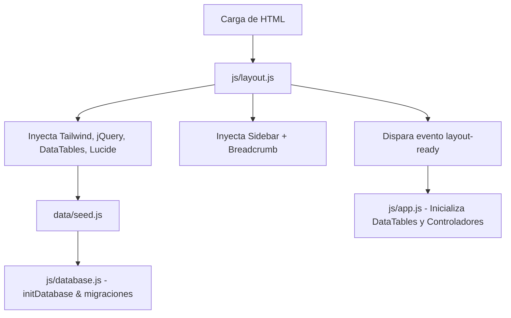

# 2. Arquitectura de Software y Pila Tecnológica

## 2.1 Visión Arquitectónica (Prototipo Actual vs. Producción)

Actualmente, el **Prototipo PIIP** opera bajo una arquitectura **Client-Side Rendering (CSR) / Multipage Application (MPA)** puramente desacoplada del servidor, orientada a la validación rápida y pedagógica (*Mock Architecture Local-First*). Toda la capa de persistencia reside en el navegador (`localStorage`), garantizando cero latencia, portabilidad inmediata y funcionamiento sin requerir servidores de backend en etapas tempranas.

### Ruta hacia Producción Institucional (Arquitectura Objetivo)
Para el pase a producción en la infraestructura oficial de AGROIDEAS:
1. Reemplazar la capa `js/database.js` por llamadas asíncronas (`fetch` / `axios`) consumiendo una **API RESTful o GraphQL**.
2. Migrar la persistencia hacia un motor de base de datos relacional institucional (PostgreSQL o MySQL) con integridad referencial estricta.
3. Integrar autenticación corporativa mediante el **Directorio Activo institucional / OAuth2** bajo el modelo de control de acceso basado en roles (**RBAC**).
4. Compilar Tailwind CSS estáticamente (`npm run build`) para eliminar el CDN en tiempo de ejecución.

---

## 2.2 Estructura Física del Proyecto

La estructura de archivos organiza semánticamente las herramientas por las fases del Doble Diamante:

```plaintext
App_Sistema_Doble_Diamante/
├── index.html                  # Dashboard principal y Portafolio Institucional (13 proyectos)
├── css/
│   └── style.css               # Estilos complementarios y personalizaciones BEM
├── fase1/                      # Fase 1: Descubrir (Divergencia - Problema)
│   ├── 01-observacion.html     # Herramienta 1: Observación AEIOU
│   ├── 02-mapa-empatia.html    # Herramienta 2: Mapa de Empatía
│   └── 03-encuestas.html       # Herramienta 3: Encuestas de Campo
├── fase2/                      # Fase 2: Definir (Convergencia - Problema)
│   ├── 04-ficha-persona.html   # Herramienta 4: Ficha de Persona / Arquetipos
│   ├── 05-grupos-focales.html  # Herramienta 5: Muro de Hallazgos (Research Wall)
│   ├── 05-muro-hallazgos.html  # Herramienta 5: Alias idéntico
│   └── 06-definicion-desafio.html # Herramienta 6: Desafío HMW (con Mad-Libs)
├── fase3/                      # Fase 3: Idear (Divergencia - Solución)
│   ├── 07-lluvia-ideas.html    # Herramienta 7: Lluvia de Ideas y Crazy 8's
│   ├── 08-matriz-priorizacion.html # Herramienta 8: Matriz de Priorización multicriterio
│   └── 09-prototipado-rapido.html  # Herramienta 9: Prototipado Rápido y Storyboard
├── fase4/                      # Fase 4: Entregar (Convergencia - Solución)
│   ├── 10-plan-accion.html     # Herramienta 10: Plan de Acción y Roadmap
│   └── 11-matriz-riesgos.html  # Herramienta 11: Matriz de Riesgos y Testeo
├── js/
│   ├── layout.js               # Inyección transversal de Sidebar, Breadcrumb y CDNs
│   ├── database.js             # Mock ORM, migraciones de esquema y CRUD en LocalStorage
│   └── app.js                  # Controlador maestro, DataTables, eventos y asistentes IA
├── data/
│   ├── seed.js                 # Base de datos semilla oficial (13 iniciativas y 11 herramientas)
│   ├── piip_01_completo_h01_a_h11.json ... piip_13_... # Datos brutos estructurados
│   └── raw_fichas.json         # Extracción cruda institucional
├── scripts/
│   ├── generate_seed.py        # Generador automático de seed.js
│   ├── extract_fichas.py       # Extractor de datos desde fichas oficiales
│   └── fix_seo.py              # Script utilitario de metadatos
└── doc/                        # Documentación técnica del sistema
```

---

## 2.3 Pila Tecnológica Frontend

* **HTML5 Semántico Multipage:** Separación modular en archivos HTML independientes por herramienta, simplificando la mantenibilidad y navegación sin sobrecargar memoria.
* **Tailwind CSS (v3.x / CDN):** Sistema utilitario de estilos para interfaces limpias, accesibles y responsivas.
* **JavaScript Puro (Vanilla ES6+):** Código nativo sin dependencia de frameworks pesados (React/Angular/Vue), reduciendo la curva de aprendizaje y facilitando su adopción por equipos institucionales.
* **jQuery (v3.7.0) y DataTables.js (v1.13.6):** Motor de visualización para tablas dinámicas, paginación, filtros multicriterio y exportación de datos.
* **Lucide Icons:** Iconografía vectorial moderna inyectada dinámicamente (`lucide.createIcons()`).

---

## 2.4 Arquitectura de Módulos JavaScript

El ciclo de ejecución en el cliente sigue una separación de responsabilidades clara:



1. **`js/layout.js` (Layout Manager & Asset Loader):**
   * Detecta la profundidad de la URL (`prefix: './'` o `'../'`).
   * Carga asíncrona y secuencial de librerías externas (Tailwind, jQuery, DataTables, Lucide) y estilos locales.
   * Inyecta en el DOM el **Sidebar de navegación global** con indicación de herramienta activa y badge del proyecto activo.
   * Inyecta el **Breadcrumb metodológico** con el estado de avance en las 4 fases.
   * Dispara el evento personalizado `layout-ready` para coordinar la inicialización segura de los controladores.

2. **`data/seed.js` (Base de Datos Semilla):**
   * Declara el objeto global `PIIP_SEED_DATA`.
   * Contiene la información oficial de las 13 iniciativas de innovación (`PIIP-2026-IN0001` a `IN0013`) y datos de ejemplo para las 11 herramientas.
   * Define la versión de esquema (`_schemaVersion: 18`).

3. **`js/database.js` (Capa de Abstracción de Datos / Mock ORM):**
   * Almacena todo el estado relacional en una única clave de `localStorage`: `piip_agroideas_db`.
   * Valida la carga previa de `seed.js` y ejecuta `initDatabase()` con **migración automática de esquema** sin destruir datos existentes.
   * Expone funciones de lectura, guardado, actualización y eliminación para las 11 herramientas.
   * Implementa **funciones de precarga contextual** (`precargarEjemploAEIOU`, `precargarEjemploMatriz`, etc.) que asocian datos al proyecto activo.
   * Gestiona el estado de `active_project_id`.

4. **`js/app.js` (Controlador General):**
   * Escucha la carga del DOM y el evento `layout-ready`.
   * Inicializa instancias de DataTables con renderizadores personalizados (ej. chips de fase D1, D2, I3, E4).
   * Administra la apertura y cambio de pestañas del **Modal de Ficha Técnica Consolidada**.
   * Controla asistentes interactivos: Asistente Mad-Libs (H06), Temporizador Crazy 8's y Votación (H07), Semáforos de severidad de riesgo (H11) y Asistente IA Mock para Prototipos (H09).

---

## 2.5 Patrón de Estado: "Entidad Global Activa"

El sistema resuelve la coherencia de datos a través de una clave de estado persistente: `active_project_id`.
* Al pulsar **"Trabajar"** en el Dashboard, se invoca `establecerProyectoActivoId(id)`.
* En cada página de herramienta, las consultas ejecutan un filtro automático:
  `registros.filter(r => r.projectId === obtenerProyectoActivoId() || projectCodesMatch(r.projectCode, activeProj.code))`.
* Al registrar un nuevo formulario, el payload hereda automáticamente el ID y código del proyecto activo, garantizando la integridad referencial.
