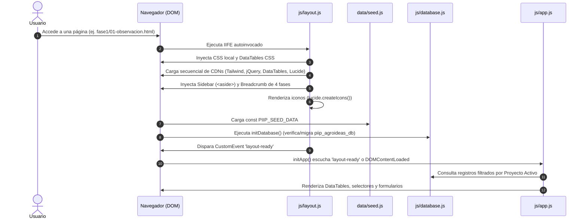

# 4. Flujos de Trabajo y Eventos del Sistema

Este documento describe con precisión la secuencia de ejecución en el navegador, el ciclo de vida de los eventos del DOM, la reactividad de la interfaz y la orquestación entre `layout.js`, `database.js` y `app.js`.

---

## 4.1 Secuencia de Arranque (Bootstrapping y Ciclo de Vida)

Debido a que el aplicativo es una arquitectura Multipage (MPA) desacoplada, cada vista HTML (`index.html` o las herramientas dentro de `fase1/` a `fase4/`) ejecuta la siguiente secuencia síncrona/asíncrona:

1. **Evaluación de Ruta:** `layout.js` detecta si el documento actual reside en raíz (`./`) o en una subcarpeta de fase (`../`) para resolver los hipervínculos dinámicamente.
2. **Inyección Estructural:** Inserta el Sidebar con su lista de 11 herramientas y destaca con clase activa el enlace correspondiente a la URL visitada.
3. **Persistencia e Inicialización de Datos:** `database.js` verifica la versión de esquema (`_schemaVersion: 18`); si la versión local es menor o inexistente, migra o inicializa las 13 iniciativas oficiales sin destruir datos de usuario.
4. **Coordinación de Renderizado:** Al completar la inyección visual y carga de librerías, se emite el evento `layout-ready`. `app.js` se activa, inicializa los componentes de DataTables, vincula los formularios y actualiza el badge del proyecto activo.

---

## 4.2 Flujo Principal: Selección y Activación de Proyecto

**Objetivo:** Establecer el contexto global de trabajo para que todas las herramientas metodológicas sepan a qué iniciativa imputar los nuevos registros.

1. El usuario se encuentra en el Portafolio Institucional (`index.html`).
2. En la tabla `#projectsTable`, pulsa el botón **"Trabajar"** de una fila específica.
3. **Trigger:** Delegación de evento `$('#projectsTable').on('click', '.btn-select-project', ...)`.
4. El controlador extrae el `data-id` y llama a `establecerProyectoActivoId(id)`.
5. `database.js` actualiza la clave `active_project_id` en `localStorage['piip_agroideas_db']`.
6. **Efectos en la UI:**
   * La fila activa en DataTables muestra el badge visual `ACTIVO` en color esmeralda.
   * El Sidebar actualiza `#sidebar-active-project-name` con el código y título del proyecto.
   * Al navegar hacia cualquier herramienta (`fase1/`, `fase2/`, `fase3/`, `fase4/`), el sistema lee este ID y aísla los datos correspondientes.

---

## 4.3 Flujo de Consulta: Ficha Consolidada del Proyecto

**Objetivo:** Permitir a evaluadores y directores inspeccionar la trazabilidad completa del Doble Diamante de una iniciativa en un solo modal.

1. En el Dashboard (`index.html`), el usuario hace clic en el botón **"Ficha"** de cualquier proyecto.
2. **Trigger:** Evento click con clase `.btn-view-project`.
3. Se invoca la función `mostrarFichaProyecto(projectId)`.
4. La función recopila de forma sincronizada desde `database.js`:
   * Datos generales de la iniciativa (`projects`).
   * Observaciones AEIOU (`aeiou`).
   * Mapa de Empatía (`empathyMap`).
   * Fichas de Persona (`personas`).
   * Desafíos HMW (`desafios`).
   * Ideas priorizadas (`ideas`).
   * Prototipos registrados (`prototypes`).
   * Hitos del Plan de Acción (`actionPlans`).
   * Matriz de Riesgos (`risks`).
5. Se inyecta la información en las 5 pestañas del modal (`#projectModal`):
   * **General:** Metadatos, contacto, responsables y cronología.
   * **Fase 1 (Descubrir):** Hallazgos de campo y empatía.
   * **Fase 2 (Definir):** Arquetipo y desafío detonador.
   * **Fase 3 (Idear):** Ideas votadas y enlace a prototipos.
   * **Fase 4 (Entregar):** Tareas del roadmap y semáforo de riesgos.
6. **Navegación de Pestañas:** Los botones `.modal-tab` alternan las clases `active border-b-2` y la visibilidad de los contenedores `#tabContent-[tab]`.

---

## 4.4 Flujo de Operación en Módulos de Herramientas (CRUD)

Tomando como ejemplo el módulo **Fase 4: Matriz de Riesgos** (`fase4/11-matriz-riesgos.html`):

1. **Carga y Filtrado:** Al iniciar la vista, se invoca `obtenerRiesgos('active')`. La función retorna únicamente los riesgos vinculados al `active_project_id`.
2. **Renderizado de Tabla:** La instancia de DataTable renderiza las filas aplicando estilos condicionales:
   * Nivel **Alto:** Chip rojo (`bg-rose-100 text-rose-800`).
   * Nivel **Medio:** Chip ámbar (`bg-amber-100 text-amber-800`).
   * Nivel **Bajo:** Chip verde (`bg-emerald-100 text-emerald-800`).
3. **Registro de Nuevo Elemento:**
   * El usuario completa el formulario `#form-risk`.
   * Al pulsar "Guardar Riesgo", el evento `submit` intercepta la petición (`e.preventDefault()`).
   * Se evalúa `obtenerProyectoActivo()`. Si no existe proyecto seleccionado, el sistema muestra una alerta solicitando seleccionar uno en el Dashboard.
   * Se calcula el nivel de riesgo mediante `calcularNivelRiesgo(probabilidad, impacto)`.
   * Se envía el payload a `guardarRiesgo(payload)`.
   * `database.js` añade el registro a la colección `risks` en `localStorage` con un `id` secuencial nuevo.
   * La tabla se refresca reactivamente vía `risksTable.clear().rows.add(...).draw(false)`.
   * El formulario se restablece (`form.reset()`).

---

## 4.5 Flujos Interactivos Especializados por Herramienta

El sistema integra comportamientos asistidos para enriquecer la dinámica de innovación:

1. **Precarga Contextual de Ejemplos (`btn-preload-example`):**
   * Disponible en las 11 herramientas.
   * Invoca funciones como `precargarEjemploAEIOU('active')` o `precargarEjemploMatriz('active')`.
   * Localiza en el seed institucional el dato de ejemplo que corresponde al proyecto activo e inserta el registro inmediatamente, actualizando la tabla sin requerir digitación manual.
2. **Asistente Mad-Libs en Desafíos (`fase2/06-definicion-desafio.html`):**
   * Dispone de campos concatenados: *"¿Cómo podríamos [Acción] + para [Usuario] + de modo que [Impacto]?"*.
   * Genera en tiempo real la pregunta HMW estructurada garantizando el rigor metodológico.
3. **Temporizador y Dinámica Crazy 8's (`fase3/07-lluvia-ideas.html`):**
   * Incluye un cronómetro regresivo de 8 minutos para facilitar dinámicas de ideación rápida en equipo.
   * Permite votar ideas (`votarBrainstorming(id)`) incrementando el contador numérico de votos con re-renderizado instantáneo.
4. **Cálculo Automático y Selección de Idea Ganadora (`fase3/08-matriz-priorizacion.html`):**
   * Suma en vivo los 4 criterios (Impacto + Viabilidad + Factibilidad + Innovación).
   * Al hacer clic en "Elegir como Ganadora", invoca `marcarIdeaGanadora(id)` la cual desmarca las anteriores y asigna el flag `isWinner: true`, preparando el insumo directo para la fase de prototipado.
5. **Asistente de Prototipado Asistido por IA (`fase3/09-prototipado-rapido.html`):**
   * Módulo que simula la interacción con Google Gemini para redactar hipótesis de prototipado, guiones de storyboard y sugerencias de experimentación.

